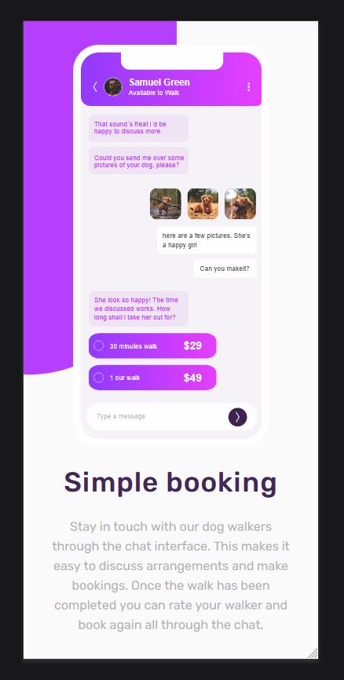
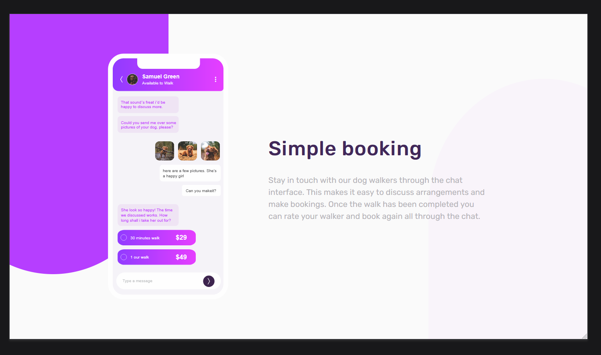

# Frontend Mentor - Chat app CSS illustration solution

This is a solution to the [Chat app CSS illustration challenge on Frontend Mentor](https://www.frontendmentor.io/challenges/chat-app-css-illustration-O5auMkFqY). Frontend Mentor challenges help you improve your coding skills by building realistic projects. 

### Screenshot

### Links

- Solution URL: (https://github.com/skarlos134/Chat-app-CSS-illustration.git)
- Live Site URL: (https://skarlos134.github.io/Chat-app-CSS-illustration/)

## My process

### Built with

- Semantic HTML5 markup
- CSS custom properties
- Flexbox
- Mobile-first workflow

## Author

- Website - [soycarloszuluaga](https://www.soycarloszuluaga.com)
- Frontend Mentor - [@skarlos134](https://www.frontendmentor.io/profile/skarlos134)

